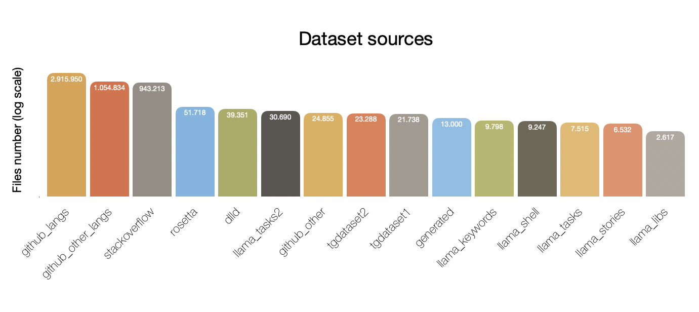

# Overview

## Task assumptions

1. In accordance with the provided dataset and examples in it, I make the following assumptions within the scope of the task
    * **Docker Compose** is a **Docker** language
    * Shell/interpreters commands with printed output should be classified as target language (commands started from **“>>>”** for **Python**, **“sql>”** for **SQL**, **“$/#”** for **SHELL** and so on)
    * For all other examples labeled "CODE" but that are not code from the provided list of languages, I determine that this is a error of provided dataset. For example: YAML (excluding docker compose)
2. In accordance with the requirement to provide training data in my submission, I assume that the dataset for training **should not exceed 2GB**
3. Due to the fact that it is not specified how to use any libraries as dependencies (only installing packages) I assume that the **solution should be standalone** (without additional shared libs) and can only use files for loading

## Used datasets

* I have **5.154.973 files amount**.
* All files were randomly **cropped by 4096 symbols**.
* Cropped files take **21Gb of space**.
* Archiving with tar + compression with [brotli](https://github.com/google/brotli) allows to reduce the size up to **1.8Gb** (with compression lvl = 9).
    * You will find there all sources with tags and list of used repos during parsing (check Technical details section)

### Sources



#### Github

* Parsed up to 1000 repos per language and copied all files with extension corresponded to language
* From dowloaded repos I copied some .md as OTHER language
* Parsed some more languages from Round1 and copied files as OTHER language
* Additionally parsed Dockerfiles to grab some Shell examples

#### Stackoverflow

* Parsed comments and posts with step 200 (~1.000.000 messages amount) as OTHER language
* Removed all code blocks from texts

#### DLLD & Rosetta

* Open datasets, manually reassigned labels
* Data is very dirty, I don’t recommend to use in future :(

#### Telegram Datasets

* Provided sets of data

#### LLAMA


I locally created server with LLM and generated datasets for ~3 days.
* **Programming tasks** (*gen_code/tasks.py*). Generated list of typical programming tasks by gpt for specific languages. I used some prompts to get different versions of the code. This dataset was fully used for testing.
* **Libs** (*gen_code/libs.py*). Generated list of typical libraries for language using ChatGPT (like boost for c++) and asked LLM to generate some examples.
* **Keywords** (*gen_code/tasks.py*). Generated list of keywords by ChatGPT and asked for examples of usage of keywords combinations.
* **Stories** (*gen_code/stories.py*). Asked LLM to pretend to be the specified character (usually different bloggers) and generate a post on the specified topic. Additionally, used different hacks: language, tables, emoticons, slang, and so on. So, should be close to OTHER language
* **Shell** (*gen_code/shell.py*). So, it is difficult to find data where terminal execution (like “sql>”) with examples of output. I prompted LLM to generate such examples for Python, Shell and SQL.
* **TL/FUNC** (*gen_code/tl.py* & *gen_code/func.py*). For these 2 quite rare languages I summarised language structure (keywords, rules, examples) and used Larger LLM to learn the language from the description and generate different examples.

#### Additional prompts and data modifications:
* **One-liners** - asked model to generate one-liners for each language with examples of library or keyword usage
* **Short version** - by given code asked model to rewrite it and prepare short version of the code
* **Language-specific keywords** - asked model to generate example in JS which is obviously not TS and vice versa. The same for C and C++.

### Files by languages

|Language|Amount of files||Language|Amount of files|
|---|---|---|---|---|
|NGINX|3930||PYTHON|73206|
|CODE|3944||SHELL|90624|
|FUNC|4853||DART|101477|
|TL|11172||RUST|137864|
|CSS|20972||RUBY|138318|
|DOCKER|32124||OBJECTIVE_C|147268|
|POWERSHELL|46920||PHP|159256|
|HTML|48679||KOTLIN|160619|
|JAVASCRIPT|49722||TYPESCRIPT|169440|
|LUA|54067||JAVA|193213|
|SQL|56816||C|193701|
|JSON|57001||CSHARP|234029|
|SOLIDITY|59440||CPLUSPLUS|318690|
|SWIFT|64325||GO|356141|
|XML|64730||OTHER|2102430|


## Algorithm

### Preprocessing

* **Encoder** is doing simple lookup for subsequence in input text by vocabulary.
* **Text analyzer** is looking for text structure. As result of this module we have arrays with masks for encoded text.
    * **Naming type** - is the token lowercase, uppercase or mixed
    * **Group type** - I'm looking for brackets and quotes to determine if token belongs to the group type. Groups: "", [], (), {}
    * **Line num** - Simple line number in the file.

### Model


* First, we calculate embeddings from lookup table
    * **Text Encoding** - using position and word embeddings with size 32 we apply convolution to upsample it up to 64. I used 32 as a size because it was a really difficult task to train model with higher dim having a huge batchsize and many embeddings. And additionally I had a motivation to keep model small (embeddings is the largest part of the model). 32 is a good compromise between size, quality and speed.
    * **Structure Encoding** - the same for structure embeddings. I used size 8 for these embeddings.
* **Feature extraction**.
    * All convolution blocks here include Conv1D, BatchNorm and ReLU activation.
    * In my experiments BatchNorm works better than LayerNorm and GroupNorm.
    * I used set of 3 downsampling blocks with 1d convolutions and stride=2, increasing number of filters from 64 to 128. Here is a key point of the model. Increasing number of filters for this block significatly increases model quality but also increases the inference time for large files with ~4096 symbols. For small files <2048 symbols it is not so important. See more in the section "Benchmarks".
    * I used **skip connection** with another conv block with stride=8 to capture global features. This block also affects a lot to the model quality.
    * As result, input sequence is downsampled to 1/16 of the original size.
* **Classification**.
    * **2x Transformer Encoder Blocks**. Basic implementation was taken from wav2vec2 (https://huggingface.co/docs/transformers/model_doc/wav2vec2) and modified to boost the latency of the model. Replaced conv positional encoding with lookup, removed most of layernorms, removed features projection.
        * So, the resulted layer is Attention -> FeedForward -> LayerNorm
    * Pooling of result and 2 classifications with linear layers: one for code vs other and one for languages

I tested 2 versions of model:
#### Small
```json
config = {
    "embedding_size": 32,
    "structure_embedding_size": 8,
    "hidden_size": 64,
    "conv_bottleneck_hidden": [64, 96, 128],
    "conv_bottleneck_features": 64,
    "intermediate_size": 128,
    "num_attention_heads": 4,
    "num_hidden_layers": 2,
}
```
#### Large
```json
config = {
    "embedding_size": 32,
    "structure_embedding_size": 8,
    "hidden_size": 64,
    "conv_bottleneck_hidden": [128, 128, 128],
    "conv_bottleneck_features": 64,
    "intermediate_size": 196,
    "num_attention_heads": 4,
    "num_hidden_layers": 2,
}
```

For submission I used **small** version of model (Check benchmarks section for details).
Final model **size is 1.2Mb** with 600.000 parameters, where ~350.000 are embeddings.

### Training

* **Dataset**. Testset contains 110.000 files and includes: rosetta dataset, generated tasks by LLAMA, telegram tests, some manually selected corner cases.
* I wrote a *gui tool* to visualise wrong predictions and manually annotate wrong labels in testset (see *playground.ipynb*). Finally about 200 samples were removed from testset.
* **Vocabulary**. For encoding I'm using simple longest match lookup. I've experimented with different tokenizers but for wordpiece or for other "smart" tokenizers small model can't learn reliable connections between tokens. Therefore I used some sources to gernerate more "obvious" vocab:
    * Create list of **keywords**, **libraries** and **special chars** with GPT
    * Used BPE and WordPiece tokenizers to prepare vocab and then converted it to my format
    * Used custom script to find **most frequent words** in the dataset (see *data.ipynb*)
    * Used many filters to remove duplicates, complex words, doubled words, etc.
    * Resulted vocab contains 6144 tokens

#### Training details

* **Loss**. I added 4 losses to the model. Basically the most often fails are with JS vs TS, C vs C++ and I used some additional losses to boost the model to learn these differences.
    * BCE with inverse sqrt class frequency weighting for languages
    * BCE for Other vs Code
    * BCE for JavaScript vs TypeScript
    * BCE for C vs C++
    * final_loss = ce_code_loss + ce_other_loss*0.5 + cpp_loss*0.2 + js_loss*0.3
* **Label Smoothing**: 0.1
* **Optimizer**: AdaBelief (WEIGHT_DECAY = 1e-1, BETAS = (0.9, 0.95))|
* **Scheduler**: Inverse Square Root Scheduler (https://fairseq.readthedocs.io/en/latest/_modules/fairseq/optim/lr_scheduler/inverse_square_root_schedule.html)
* **BatchSize**: epochs 1-60: 1024, 61-90: 2048, 90-130: 4096
* **Augs**
    * Select 1-60 lines from each file
    * Remove up to 2% of chars in source text
    * Mask up to 5% of tokens
    * Mixup 2 random samples of differnet languages with 0.5 for resulted label
    * For stackoverflow I used random text crop
* **Weights Initializer**: Kaiming
* **GradientClip**: 2.0
* **Epochs**: 150
* **MaxTokens**: 4096

### Inference

I used these benchmarks as references:
- https://arxiv.org/pdf/2303.05016.pdf
- https://medium.com/microsoftazure/accelerate-your-nlp-pipelines-using-hugging-face-transformers-and-onnx-runtime-2443578f4333

The sorted list of leading frameworks for desktop x86 cpus looks like this: OnnxRuntime, Torch, TFLite, Openvino

- I added onnx runtime inference support because of supported oneDNN but the resulted library size was about 500Mb even with minimal build. Although it was the fastest solution the library size and the loading time is a critical factor for the solution. Increasing library size we need to remove some data from training :(
- I've also built LibTorch but only in shared mode. Static linking is not supported for latest versions. So, taking into account initial assumption that the solution should be standalone I didn't use it.
- So, finally I stopped with my solution from the Round 1 and used TFLite. The final library size is 7.5Mb.
    - I built tflite with xnnpack (https://github.com/google/XNNPACK) but for my setup pure XNNPACK was slower than TFLite.

Resulted tricks:
- quantization to float16 (~1.5 times faster for some cpu)
- model inbuilt directly to library (no need to load weights)

Typicaly we can convert model to tflite through torch -> onnx -> keras -> tflite.
But some issues:
- onnx -> keras conversion has issues with dynamic shapes
- the resulted graph seems to be not optimal

So, I wrote my own converter from torch to tflite.
- I implemented the same layers as in torch model (see *model/tf_tglang.py*)
- Converted directly weights from torch to tflite (see *playground.ipynb*)
- Torch and Tensorflow have different implementations of Conv1D with stride > 1. I implemented custom Conv1D layer for torch to work with stride > 1 (see *model/tglang.py*)

### Benchmarks

* **Dataset** - I used 10.000 files from testset for benchmarks
* I used Docker image 'debian:10' and container with limited cpu (8 cores)
* Testing script (*src/scripts/test.sh*) measures full program time with inbuilt command '_time_', including library initialization and file reading.
* I used python script (*src/scripts/analyse.py*) to prepare reports with metrics for C++ version. And some metrics from python tests (*playground.ipynb*)
* **Hardware**:
    * AMD Ryzen Threadripper PRO 5965WX (48 cores, 3.8GHz)
    * Intel Core i5 (4 cores, 2.4GHz)
* **Models**: I tested Large Model, Small Model and for general accuracy I also tested model from Round1.

#### Overall accuracy

MobileBert is my solution from Round 1. During testing I'm marking all excluded languages as OTHER.


#### Latency per input length

Here and farther I'm only testing solution for Round 2.


Using input_length=4096 as a target metric for decision, I choodsed a small model for this submission.

#### Per label accuracy (Small model)


JSvsTS & CvsC++ are typical fails for the model. Even with generated data which exactly splits these languages, the model still fails to learn small differences.

#### Accuracy per file length (Small model)


Short samples is still an issue for the model. But mostly it is connected with number of features in the model neither with the receptive field. (See more in failed ideas section)

#### Profiling inference pipeline


### Failed ideas

1. **The second model** for short samples. Due to the 1/16 downsampling on convolution it seems like short text could be overrided with paddings. Therefore I was trying to train another model with smaller receptive field for handling files with length <512. But resulted model worked even worse than original one. Additional problem could be with limited representation of such data in dataset. Anyway, the most efficient solution was increasing features num for the model.
2. **Head cascading** (https://arxiv.org/abs/2210.05528). The idea in horizontal scaling: we have N heads and 1 classifier which do classification to find the best head for current input. Implemented simple version, but got 2 issues:
    * The classification itself slowdown the model for ~15% and is not accurate at all.
    * Couldn't manage how to catch the balance between heads (in my implementation one head was significatly dominating during training and testing)
3. **ONNXRuntime** as I mentioned above it is the fastest inference I could use, but the library size is too huge.
4. **Custom inference** so, just to validate hypotis, I implemented one Conv1D layer using only bare c++ and omp and inbuilt all data in header (all weights precompiled to library). But in my experiment initialisation was obviosly much faster than tflite (I didn't have initialisation to be correct). But inference was slower comparing with tflite. Seems like I need to use some build features, haven't found which...
5. **Focal loss** - didn't affect
6. **contrast loss** - good practice and affected but worse than Mixup augmentation, therefore I only used mixup
7. **Strong Tokenizers** - trained with tf_text tokenizers but the result was much worse. Stopped this direction, seems like model should be bigger to capture bert-like tokens.
8. **XNNPack** - attempted to put some optimization but just slower. TFLite default configuration seems quite optimal.

# Technical details


## Unpack dataset ([brotli](https://github.com/google/brotli))

```bash
$ sudo apt install -y brotli
$ brotli -d ./dataset.tar.br
$ tar -xf ./dataset.tar
```

## Create train df

```python
import os
import pickle
import pandas as pd

root_path = "./export"

data = []
for root, dirs, files in os.walk(root_path):
    if root[len(root_path):].count(os.sep) == 2:
        for file in files:
            if file.endswith('.txt'):
                path_parts = root.split(os.sep)
                source = path_parts[-2]
                tag = path_parts[-1]
                absolute_path = os.path.abspath(os.path.join(root, file))
                data.append({'source': source, 'language_tag': tag, 'path': absolute_path})

df = pd.DataFrame(data)

with open("./export.pickle", "wb") as f:
    pickle.dump(df, f)
```
